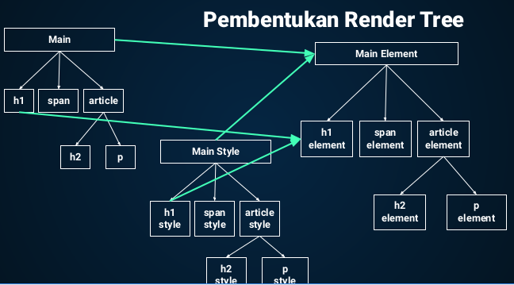

# Function

-   function pada JS adalah sebuah blok kode dalam sebuah grup untuk menyelesaikan 1 task atau 1 fitur, saat kita membutuhkan fitur tersebut, kita bisa menggunakannya kembali

-   syntax membuat function

    ```
    function namaFunction() {
    	//baris kode
    }
    ```

    > -   function = function keyword
    > -   namaFunction = identifier
    > -   di dalam curly bracket = function body

-   cara memanggil function

    ```
    namaFunction()	//bila tidak ada parameter
    namaFunction(param1, param2, ...) //bila ada parameter
    ```

-   mendeklarasikan fungsi kemudian memanggilnya

    ```
    	function namaFunction(param1, param2, ...) {
    		//baris kode
    	}

    namaFunction(argumen1, argumen2, ...)
    ```

-   parameter pada function berfungsi untuk memberi inputan pada function, argumen merupakan nilai inputan yan diberikan pada function

-   default parameter digunakan untuk memberi nilai awal / default pada parameter function, bila tidak ada input argumen saat memanggil function, maka nilai default yang dipakai sebagai inputan
    ```
    function namaFunction(param1 = 'value param 1') {
    	//baris kode
    }
    ```
-   kita bisa menggunakan function yang sudah dibuat pada function lain
-   arrow function = syntax function yang diperkenalkan pada ES6
    ```
    const namaFunction = (param1, param2, ...) => {
    	//baris kode
    }
    ```
-   single line function (tanpa curly bracket)
    ```
    const namaFunction = param => //baris kode;
    ```
-   multi line function (harus dibungkus curly bracket)
    ```
    const namaFunction = param => {
    	//baris kode
    }
    ```

# Scope

-   scope menentukan suatu variabel bisa diakses pada scope tertentu atau tidak
-   scope yang bisa diakses dimanapun pada suatu file disebut global scope, agar menjadi global scope, variabel harus dideklarasikan di luar blocks
-   scope yang berada dalam curly bracket hanya bisa diakses di dalam curly bracket, dinamakan block scope / local scope

    ```
    function namaFunction(param) {
    	let variabel1 = param

    	return variabel1
    }

    console.log(namaFunction(arg1)) //output = arg1
    console.log(variabel1) //error
    ```

# Tipe Data

-   number : mendukung operasi aritmatika

-   string : tidak mendukung operasi aritmatika, data berupa teks yang bisa mengandung huruf, angka, simbol, dll

-   boolean : kunci dari operasi logika dan kondisional

-   primitive vs non-primitive data
    -   tipe data primitive : tipe data dasar
    -   tipe data non-primitive : tipe data turunan dari data dasar (object, array)

# DOM (Document Object Model)

-   overview proses rendering di browser
    -   HTML => parsing => tokens => DOM
    -   CSS => parsing => tokens => CSSOM
    -   DOM + CSSOM = render tree
    -   layouting
    -   pembentukan render tree (gambar 1)
        
-   Jika saat proses parsing HTML, ditemukan tag **script**, secara default proses parsing akan dihentikan sampai script tersebut selesai diunduh dan dijalankan (gambar 2)
-   Jika script yang diunduh itu besar, ada jeda yang cukup lama antara halaman mulai dimuat sampai keluar tampilan, solusinya adalah :

    > -   Taruh tag **script** eksternal sebelum tag penutup **body** - ini solusi paling umum agar dia mulai diproses setelah parsing HTML selesai
    > -   Taruh tag **script** sedini mungkin dan gunakan atribut async - atribut async akan membuat script tersebut diunduh tanpa menghentikan proses parsing dan dieksekusi seselesainya ia diunduh. (gambar 3)
    > -   Untuk script yang bergantung pada DOM, taruh tag **script** sedini mungkin, dan gunakan atribut defer - atribut defer akan membuat script tersebut diunduh tanpa menghentikan proses parsing dan dieksekusi seselesainya proses parsing selesai.(gambar 4)

-   DOM bukan bagian dari JavaScript, melainkan browser (Web API)
-   mencari elemen HTML (gambar 5)
-   mengubah konten elemen
    -   Element.textContent : digunakan untuk mengubah teks di dalam sebuah element (gambar 6)
    -   Element.innerHTML : digunakan untuk mengubah konten HTML di dalam sebuah element. (gambar 7)
    -   perbandingan innerHTML dan textContent (gambar 8)
-   membuat elemen HTML
    -   createElement()
    -   .textContent untuk mengubah kontennya
    -   .appendChild() untuk menambah ke dalam DOM
-   komunikasi antara HTML dan JS melalui event

    -   menangkap interaksi user

        ```
        Element.addEventListener("event")
        ```

    -   instruksi tertentu
        -   click : element yang diklik akan melakukan suatu
        -   blur : element kehilangan fokus dari user (misal user klk mouse di luar element tersebut atau user klik tab untuk berpindah element)
            -form submission (gambar 9)
