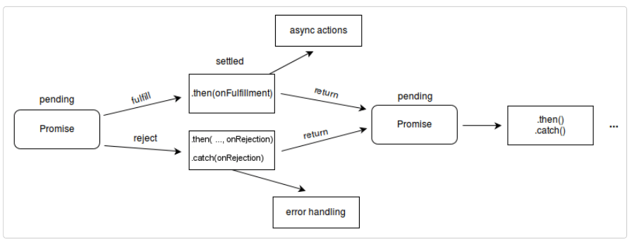

# Asynchronous Javascript

-   synchronous dalam pemrograman adalah konsep dimana sebuah program hanya dapat menjalankan satu task dalam satu waktu, program tidak dapat menjalankan task selanjutnya sebelum task-task sebelumnya selesai dieksekusi
-   asynchronous dalam pemrograman adalah konsep dimana sebuah program dapat berjalan dalam beberapa task secara bersamaan, tanpa menunggu task sebelumnya selesai
-   callback adalah suatu fungsi yang dipanggil didalam fungsi yang lain, konsep callback banyak dipakai di asynchronous JS

    ```
    function doStep1(init, callback) {
        const result = init + 1;
        callback(result);
    }

    function doStep2(init, callback) {
        const result = init + 2;
        callback(result);
    }

    function doStep3(init, callback) {
        const result = init + 3;
        callback(result);
    }

    function doOperation() {
        doStep1(0, (result1) => {
            doStep2(result1, (result2) => {
                doStep3(result2, (result3) => {
                    console.log(`result: ${result3}`);
                });
            });
        });
    }

    doOperation();
    ```

-   callback bersarang yg jumlahnya sangat banyak seperti diatas bisa menyebabkan susah untuk dibaca dan di-debug, hal ini disebut sebagai callback hell. oleh karena itu developer JS banyak menggunakan promise yg lebih simple
-   Promise merupakan sebuah objek yg berisi informasi mengenai kondisi operasi asynchronous apakah terpenuhi atau rejected, promise memiliki 3 state

        -   pending : promise masih dalam proses
        -   fulfilled : promise terpenuhi
        -   rejected : promise rejected

    

-   status pending berarti masih menggantung dan tidak bisa dipasangkan dengan event handler. Event handler bisa dipakai ketika promise telah selesai, baik fulfilled atau rejected.

    ```
    new Promise((resolveOuter) => {
        resolveOuter(
            new Promise((resolveInner) => {
                setTimeout(resolveInner, 1000);
            })
        );
    });
    ```

-   fetch adalah ketika melakukan request ke server, baik berupa GET, POST, PUT, atau DELETE

    ```
    fetch(url)
        .then((response) => {
            if (!response.ok) {
                throw new Error(`HTTP error: ${response.status}`);
            }

            return response.text();
        })
        .then((text) => display.textContent = text)
        .catch((error) => display.textContent = `Could not fetch verse: ${error}`);
    ```

# Git & GitHub

-   git adalah salah satu VCS (Version Control System) populer yang digunakan untuk mengelola versi kode dari program / project yang dibuat atau untuk berkolaborasi

-   repository adalah folder / tempat tempat penyimpanan file /project yang akan dibuat

-   setup awal git

    ```
    git config --global user.name "nama" //set username

    git config --global user.email contohemail@mail.com //set email
    ```

-   git dapat melacak perubahan yang terjadi ada folder / file, selama folder / file tersebut masukke staging area melalui command

    ```
    git add namafile //untuk menambahkan file pada staging area

    git add namafolder //untuk menambahkan folder pada staging area

    git add . //untuk memasukkan semua file / folder dalam suatu direktori
    ```

-   tahap git dari untracked hingga staged
    

    -   untracked : file / folder tidak dapat terdeteksi perubahannya karena belum dimasukkan ke staging area
    -   unmodified : kondisi saat file / folder sudah masuk ke staging area, tetapi isi file tida berubah
    -   modified : kondisi saat file sudah masuk ke staging area dan terjadi perubahan yg bisa dideteksi git
    -   staged : kondisi dimana file baru ditambahkan ke staging area atau file tracked yg dimodified kembali ditambahkan ke staging area

-   git commit digunakan untuk menyimpan perubahan pada version control

    ```
    git commit -m "pesan commit"
    ```

-   remote repository adalah tempat penyimpanan file / folder di cloud
-   git push digunakan untuk menyimpan file / folder ke remote repository
    ```
    git push -u origin main
    ```
-   sebelum file / folder dapat ditambahkan ke remote repository, harus didefinisikan dulu target tujuan remote repository, digunakan command
    ```
    git remote add origin linkremoterepo.git
    ```

# Responsive Web

-   Responsive Web Design (RWD) bertujuan untuk membuat desain website dapat diakses dalam device apapun
-   untuk melihat web kita sudah responsif pada browser, dapat menggunakan Chrome Dev Tools untuk melebar-menyempitkan ukuran layar device
-   web responsive dapat membaca ukuran layar device, diatur dalam tag <head> elemen HTML dengan menambahkan tag
    ```
    <meta name="viewport" content="width=device-width, initial-scale=1.0">
    ```
-   pada css, responsif bisa diatur menggunakan media querry

    ```
    @media screen and (min-width: size) {
        selector1 {
            property1: value1;
            property2: value2;
        }

        selector2 {
            property1: value1;
            property2: value2s
        }
    }
    ```
