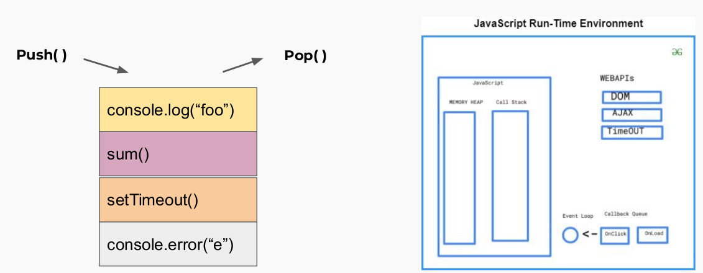
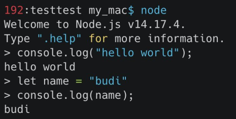
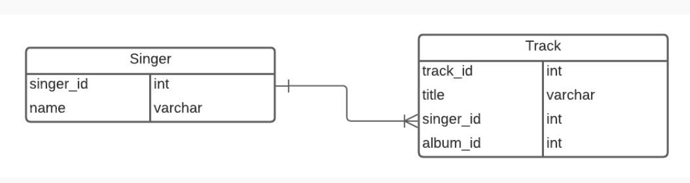
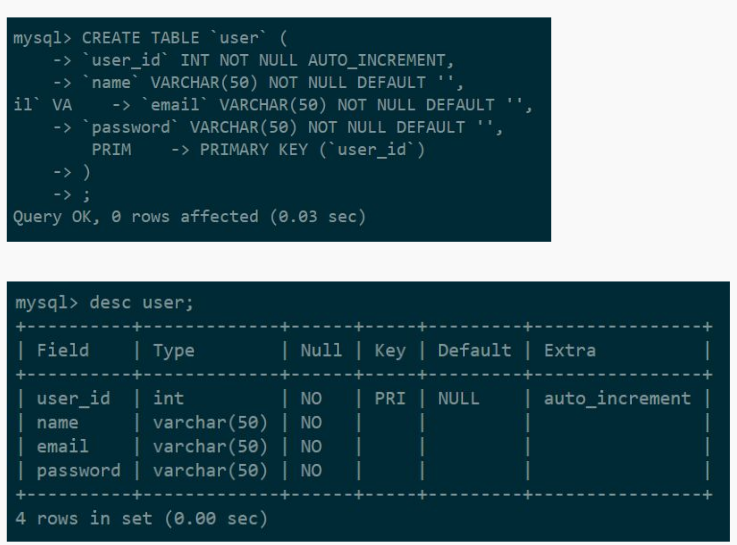

# Web Server & RESTful API

-   secara physical, web server terdiri dari 2 bagian :

    -   Hardware : secara hardware, web server berupa perangkat keras komputer yg terhubung dengan jaringan yg menyimpan berbagai software dan data yg mendukung adanya layanan web server

    -   Software : secara software, web server merupakan perangkat lunak yg mengandung berbagai protokol software seperti HTTP, dll. yg dapat memanipulasi file yg dikrim, dll

-   ilustrasi cara kerja web server
    

-   secara cara kerja, web server terbagi kedalam :

    -   Static Web Server : merupakan komputer (hardware) dengan HTTP server (software) yg bisa mengirim file yg dihosting kedalam browser / software yg merequestnya

    -   Dynamic Web Server : merupakan static web server dengan tambahan fungsionalitas lain. disebut dynamic karena server dapat mengupdate dan memproses file yg dihostingnya sebelum file tersebut dikirim ke client melalui protokol HTTP

-   Server Side Programming : web server menunggu request dari client dan membalas dengan HTTP message response yg mengandung response status beserta body yg mengandung text, json, file, dll yg akan ditampilkan kedalam browser

-   Static Sites : mengembalikan hard-code tanpa pengolahan / pemrosesan data lebih lanjut


-   Dynamic Sites : respons dari konten dapat diolah / diproses secara dinamis sebelum dikirim ke client (ketika dibutuhkan). Dynamic site dapat mengembalikan data yang berbeda tergantung input dari client dan algoritma pengolahan data pada server

-   yang dapat dilakukan pada server-side

    -   Efficient storage and delivery of information
    -   Customised user experience

    -   Controlled access to content

    -   Store session/state information

    -   Data analysis

-   REST (REpresentational State Transfer) : gaya arsitektural yang menyediakan standar antara computer systems dengan web yag dapat membuat proses komunikasi antar komputer dan perangkat menjadi efisien dan mudah. RESTful adalah sistem yang menerapkan REST

-   dalam arsitektur REST, proses antara client dan server dapat berjalan tanpa harus saling mengetahui proses satu sama lain (stateless). hal ini dapat memberi keunggulan berupa code pada client dapat saja berubah tanpa harus mengganggu proses operasi pada server, begitu pula sebaliknya

-   komunikasi antara client dan server

    -   client membuat request pada server (dlm kasus ini, menggunakan protokol HTTP) yang berisi :

        -   header : berisi informasi request
        -   resources path
        -   body : mengandung data yg hendak dikirim (opsional)
        -   req terdiri dari :
            -   GET — meminta suatu informasi / response dari server
            -   POST — menambahkan informasi pada server
            -   PUT — mengudate informasi pada server
            -   DELETE — menghapus informasi pada server

    -   Response

        -   Content Types : mengembalikan konten dengan tipe yg sesuai yg di-request oleh client, contohnya :

            ```
            //request

            GET /articles/23 HTTP/1.1
            Accept: text/html, application/xhtml
            ```

            ```
            //response

            HTTP/1.1 200 (OK)
            Content-Type: text/html
            ```

        -   response codes : respons header yang berisi kode yg menunjukan apakah request client berhasil atau tidak

        

# Node JS

## Intro

-   menurut wikipedia, Node JS adalah open-source, cross-platform, back-end JavaScript runtime environment that runs on the V8 engine and executes JavaScript code outside a web browser. Node.js lets developers use JavaScript to write command line tools and for server-side scripting—running scripts server-side to produce dynamic web page content before the page is sent to the user's web browser.

-   Arsitektur Node JS

    -   Single Thread : Thread dalam ilmu komputer adalah eksekusi menjalankan beberapa tugas atau program secara bersamaan. Setiap unit yang mampu mengeksekusi kode disebut thread. Javascript menggunakan konsep single thread, yang berarti hanya memiliki satu tumpukan panggilan yang digunakan untuk menjalankan program.

    -   Javascript menggunakan call stack untuk melakukan manajemen single thread. Ketika terdapat perintah baru maka akan ditambahkan (push) dan akan di keluarkan ketika perintahnya sudah selasai (pop)

    

    -   Even Loop : Dengan menggunakan konsep arsitektur javascript, walaupun menggunakan single thread tetapi kita dapat melihat javascript seperti menggunakan multi thread Terdapat event queue yang berguna sebagai penampung ketika terdapat perintah baru yang akan dieksekusi. Event loop akan memfasilitasi kondisi ini, event loop akan memeriksa terus menerus, ketika antrian kosong di call stack maka akan menambah antrian baru dari event queue sampai semua perintah selesai di eksekusi.

    -   Server side scripting : Sejatinya javascript merupakan bahasa pemrograman yang digunakan di front end side. Sehingga kita hanya bisa mengerjakan javascript dengan menggunakan browser untuk menampilkan hasil eksekusinya. Tetapi dengan menggunakan NodeJS kita dapat menjalankan javascript di server side menggunakan terminal command line menggunakan perintah “node”.

## Instalasi NodeJS

-   install Node JS pada Debian-based Linux menggunakan command pada terminal

    ```
    sudo apt update

    sudo apt install nodejs
    ```

-   untuk mengecek versi, digunakan command

    ```
    node -v

    npm-v
    ```

-   untuk menjalankan REPL NodeJS, bisa menggunakan command

    ```
    node
    ```

    

-   beberapa built-in module pada node JS
    -   console : menampilkan kode / debug
    -   process : menampilkan / mengontrol proses Node JS yg sedang dijalankan
    -   os : menyediakan informasi terkait sistem operasi komputer yang digunakan user.
    -   util : Module Util merupakan alat bantu / utilities untuk mendukung kebutuhan internal API di Node JS
    -   errors : modules yang dapat digunakan untuk mendefinisikan error di Node JS sehingga lebih informatif. Kita juga dapat menghandle error menggunakan try catch
    -   fs : module yang dapat membantu berinteraksi dengan file yang ada diluar code. FS paling sering digunakan untuk membaca file dengan ekstensi .txt, .csv, dan .json

## NodeJS for Back End Development

-   Node.js memiliki built-in modul yang disebut HTTP, built-in modul ini memungkinkan Node JS mentransfer data melalui Hyper Text Transfer Protocol (HTTP). Modul HTTP dapat membuat server HTTP yang mendengarkan port server dan memberikan respons kembali ke klien.
-   Node JS Web Server

    -   Untuk menggunakan modul HTTP, gunakan require()
    -   Gunakan method createServer() untuk membuat server HTTP
    -   Callback function yang digunakan pada method http.createServer(), akan dijalankan ketika seseorang mencoba mengakses komputer pada port 8080.

    ```
    const http = require('http');

    http.createServer((req, res) => {
        res.write('hello from server');
        res.end();
    }).listen(8080);
    ```

-   Menambahkan HTTP Header

    -   Kita bisa menggunakan method res.writeHead() untuk menambahkan header HTTP.
    -   Argumen pertama dari method res.writeHead() adalah status code, 200 berarti semuanya OK
    -   Argumen kedua adalah objek yang berisi header respons.
    -   Contoh : Jika respons dari server HTTP seharusnya ditampilkan sebagai HTML, maka kita harus menambahkan header HTTP dengan tipe konten yang benar

    ```
    const http = require('http')

    http.createServer((req, res) => {
        res.writeHead(200, {'Content-Type': 'text/html'});
        res.write('hello dari server');
        res.end();
    }).listen(8080);
    ```

-   Membaca Query String

    -   Callback function pada method http.createServer() memiliki argumen req yang mewakili request dari klien, sebagai objek (objek http.IncomingMessage).

    -   Objek ini memiliki sebuah properti yang disebut "url" yang menyimpan informasi url yang sedang mengakses.

    ```
    const http = require('http');

    http.createServer((req, res) => {
        res.writeHead(200, {'Content-Type': 'text/html'});
        res.write(req.url);
        res.end();
    }).listen(8080);
    ```

# Express JS

## Intro

-   menurut wikipedia, Express JS adalah back end web application framework for Node.js, released as free and open-source software under the MIT License. It is designed for building web applications and APIs. It has been called the de facto standard server framework for Node.js.

-   Back end app adalah aplikasi yang berjalan di server-side yang bekerja untuk memberikan informasi berupa data sesuai request dari client / browser / front end app. Umumnya server-side app membuat REST API

-   Kelebihan dari framework ini terletak pada fitur caching, support dengan Google V8 Engine, JavaScript, serta didukung oleh komunitas dan skalabilitas aplikasi yang baik.

-   REST (Representional State Transfer) adalah sebuah arsitektur metode komunikasi yang menggunakan protokol HTTP untuk pertukaran data dimana metode ini sering diterapkan dalam pengembangan aplikasi. Dengan tujuannya untuk menjadikan sistem memiliki performa yang baik, cepat dan mudah untuk di kembangkan (scale) terutama dalam pertukaran dan komunikasi data.

-   RESTFUL API memiliki 4 komponen penting yaitu:

    -   URL Design
    -   HTTP Verbs
    -   HTTP Response Code
    -   Format Response

-   Instalasi menggunakan npm

    ```
    npm install express --save
    ```

-   nodemon juga perlu diinstall (opsional) untuk memudahkan proses development

    ```
    npm install --save-dev nodemon
    ```

## Syntax

-   syntax dasar

    ```
    const express = require('express');
    const app = express();
    const PORT = 3000;

    app.get('/', (req, res) => {
        res.send('hello from server');
    });

    app.listen(PORT, () => {
        console.log(`app berjalan pada http://localhost:${PORT}`);
    });
    ```

-   Routes : sebuah end point yang diapat kita akses menggunakan URL di website. Didalam routes kita perlu menentukan method API, alamat dan response apa saja yang akan dikeluarkan

-   Response : Di dalam route kita dapat mengirim response menggunakan parameter dari route express.js yaitu “res.Send()” untuk mengirim plain text ketika kita mengakses route tersebut. Terdapat banyak response yang bisa kita buat selain yang dicontohkan.

-   Kita dapat mengirim response berupa output json yang biasa dipakai untuk back end application. Dengan menggunakan output json maka kita dapat mengirim data yang mudah diakses

```
app.get('/hello', (req, res) => {
    res.json({
        name: 'budi',
        age: 23,
        greeting: 'halo, salam kenal'
    })
})
```

-   Middleware function adalah sebuah fungsi yang memiliki akses ke object request (req), object response (res), dan sebuah fungsi next didalam request-response cycle.
-   yang bisa dilakukan oleh function middleware
    -   Menjalankan kode apapun.
    -   Memodifikasi Object Request dan Object Response.
    -   Menghentikan request-response cycle.
    -   Melanjutkan ke middleware function selanjutnya atau ke handler function dalam suatu request response cycle.
-

# Intro Database MySQL

-   salah satu jenis database relasional

-   database relasional adalah database yg tersusun rapi dalam satu atau beberapa table dan bisa saling memiliki hubungan keterkaitan antara satu table dengan table yg lain

-   entity adalah suatu objek (table) yg memiliki beberapa attribute dalam database

-   attribute adalah karakteristik / nilai dari suatu entity

-   nilai dari suatu kolom dalam table dapat memiliki berbagai macam tipe data, tipe data umum pada database MySQL antara lain :

    -   CHAR(size) : string dengan panjang sesuai size yg didefinisikan,maksimal 255 karakter
    -   VARCHAR(size) : string dengan panjan sesuai size yg didefinisikan, maksimal 65535 karakter
    -   BOOL : boolean, nilai 0 berarti false,nilai 1 berarti true
    -   INT(size) : integer / bilangan bulat dengan maksimal karakter sesuai size yg didefinisikan
    -   FLOAT : bilangan tidak bulat (terdapat koma)

-   relasi adalah hubungan antar table dalam database, berikut contoh relasi antara tabel penyanyi dan track
    

-   relasi diatas adalah cntoh relasi one to many, singer memiliki banyak track, sedangkan track hanya punya satu penyanyi
-   syntax MySQL dalam membuat Table User

    ```
    CREATE TABLE 'user' (
        'user_id' INT NOT NULL AUTO_INCREMENT,
        'name' VARCHAR(50) NOT NULL DEFAULT '',
        'email' VARHAR(50) NOT NULL DEFAULT '',
        'password' VARCHAR(50) NOT NULL DEFAULT '',
        PRIMARY_KEY ('user_id')
    )
    ```

-   output dari syntax membuat database diatas
    
