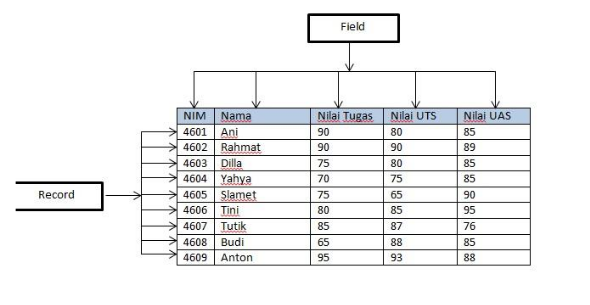
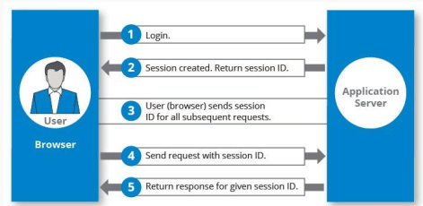

# Intro to Back End Development

-   Back End Development merupakan bagian dalam pengembangan aplikasi (web / mobile) yang tidak terlihat secara langsung oleh user. Back End mencakup segala teknologi dari sisi server suatu aplikasi.

-   secara garis besar, Back End Tech Stack mencakup server, database, API

-   server adalah suatu jaringan komputer yang menyediakan layanan tertentu pada komputer lain yang terhubung pada jaringan. server bekerja berdasarkan permintaan dari client.

-   database merupakan kumpulan data yang disimpan secara sistematis sehingga memudahkan dalam proses querry / manipulasi. database terbagi kedalam Relational database dan Non-Relational database.

-   relational database menggunakan kumpulan tabel yang berisi baris dan kolom yang tersusun secara sistematis sehingga bisa menciptakan hubungan antar baris - kolom atau antar tabel

-   non-relational database merupakan database yang menggunakan hubungaan key value pair dan tidak terdapat hubungan relational antar data

-   API adalah sekumpulan instruksi program dan protokol yang digunakan untuk membangun software.

-   REST API bertugas sebagai penghubung/perantara antara Front-End dan Back-end untuk saling bertukar informasi(request dan response).

-   dalam back end, terdapat tech stack Populer, yaitu MERN (MongoDB, Express, React, Node) yang merupakan paket komplit pengembangan aplikasi web, MongoBD berperan sebagai database, Express berperan sebagai back end (routing), React berperan sebagai front end, dan Node berperan sebagai back end (filesystem, dll).

-   MERN stack banyak digunakan karena memiliki dukungan komunitas yang besar dan banyak digunakan oleh berbagai perusahaan, seperti : LinkedIn, ebay, medium, paypal, netflix, dll.

# Database MySQL

-   Database adalah kumpulan informasi yang disimpan didalam komputer secara sistematik dan saling berelasi. Database merupakan sekumpulan tabel yang berisikan informasi untuk diolah yang kemudian data tersebut bisa digunakan di dalam sebuah sistem.

-   Untuk membuat Database diperlukan sebuah software yang dinamakan dengan DBMS(Database Management System). DBMS adalah software yang dapat digunakan oleh user untuk berkomunikasi dengan data yang ada dalam media penyimpanan.

-   Tipe utama pada Database management System antara lain, Hierarchical, Network, Relational, Non Relational, and Object Oriented.

-   salah satu contoh database relasional adalah MySQL, cara instalasi MySQL pada OS Linux :

```
sudo apt update

sudo apt install mysql-server
```

-   istilah yang ada pada database MySQL

    -   Table : kumpulan value yang dibangun oleh baris dan kolom yang didalamnya berisikan atribut dari data.

    -   Field : kolom dari sebuah tabel dimana masing-masing field memiliki tipe data masing-masing.

    -   Record : kumpulan nilai yang saling terkait. Record merupakan isi dari sebuah tabel (baris).

        

    -   SQL (Structured Query Language) : suatu bahasa (Language) yang digunakan untuk mengakses database dan melakukan manipulasi / interaksi di RDMS. SQL terdiri dari :

        -   DDL (Data Definition Language) : kumpulan perintah SQL yang digunakan untuk membuat, mengubah dan menghapus struktur dan definisi metadata dari objek-objek Database. contoh command DDL

        ```
        # membuat table pada database
        CREATE TABLE data_mahasiswa (
            nim varchar(15) PRIMARY KEY,
            nama varchar(50),
            jurusan varchar(30),
            email varchar(29)
        );

        # menambah primary key
        ALTER TABLE data_mahasiswa ADD PRIMARY KET (email);

        # menambah kolom / field
        ALTER TABLE data_mahasiswa ADD dosen_pembimbing varchar(30);
        ```

        -   DML (Data Manipulation Languange) : kumpulan perintah SQL yang digunakan untuk manipulasi struktur dan data dari objek-objek Database. contoh command DML :

        ```
        # menginputkan record pada table
        INSERT INTO data_mahasiswa VALUES (19455TK44911, 'joko widodo', 'Teknik Sastra', 'jokowiganteng@gmail.com');

        # memilih data berdasarkan kriteria tertentu
        SELECT nama FROM data_mahasiswa WHERE nama = 'joko widodo';

        ```

        -   DCL (Data Control Languange) : kumpulan perintah SQL yang digunakan untuk memberikan kontrol akses pada user lain. contoh command DCL :

        ```
        # memberikan hak akses pada user
        GRANT INSERT, UPDATE, DELETE ON data_mahasiswa TO PUBLIC;

        # mencabut hak akses yg telah diberikan pada user
        REVOKE SELECT ON data_mahasiswa TO PUBLIC;
        ```

-   database relationship adalah relasi atau hubungan antara beberapa tabel dalam bahasa yang kita miliki. Relasi antar tabel dihubungkan oleh Primary key dan foreign key.

    -   Primary key : atribut yang tidak hanya mengidentifikasi secara unik suatu kejadian, tapi juga mewakili setiap kejadian suatu entitas.

    -   Foreign key : atribut yang melengkapi relationship dan menunjukan hubungan antara tabel induk dengan tabel anak.

-   tipe relationship pada database relasional

    -   One To One Relationships
    -   One to Many and Many to One Relationships
    -   Many to Many Relationships
    -   Self Referencing Relationships

# Authentication & Authorization

### Authentication

-   authentication adalah proses untuk mengidentifikasi identitas dari user yang login

-   user bisa dikenali dari banyak faktor, 3 diantaranya :

    -   sesuatu yg dikenali sistem dan user, contohnya email dan password

    -   sesuatu yang dimiliki user, contohnya token

    -   biometrik yg dikenali sistem, contohnya fingerprint, retina, dll

-   berdasarkan jumlah langkahnya, authentication dibagi menjadi

    -   single factor authentication : hanya menggunakan 1 langkah authentication, contohnya :

        -   username dan password
        -   pin
        -   token

    -   multifactor authentication : menggunakan 2 / lebih langkah authentication, contohnya :
        -   pin dan otp
        -   username password dan otp
        -   in dan fingerprint, dll

### Authorization

-   authorization adalah proses memberi hak akses keada user yang sudah dikenali / teridentifikasi

-   authorization penting untuk memastikan bahwa user tertentu saja yang boleh mengakses, memodifikasi, atau menggunakan suatu layanan

-   salah satu tools yang bisa mendukung penerapan authentication dan authorization secara aman adalah encryption, encryption adalah proses mentransformasi data kedalam bentuk yang tidak bisa dibaca secara langsung, sehingga orang lain tidak bisa mengetahui informasi yang seharusnya tidak diketahui

-   web session juga merupakan tools yang mendukung authentication dan authorization, web session mengacu pada serangkaian interaksi pengguna selama jangka waktu tertentu. Data session disimpan di sisi server dan dikaitkan dengan session ID. web sesion dimaksudkan agar user tidak perlu login berulang kali untuk mengunjungi sesuatu yang sudah ter-authentication, hal ini menyebabkan user experience menjadi lebih baik



-   Cookie adalah bagian kecil dari data (maksimal 4kb) dalam bentuk teks yang disimpan otomatis oleh browser yang menjadi kunci user dalam authentication dan authorization apabila user mengunjungi sebuah website tertentu. cookie digunakan dalam bentuk key-value pair. cookie seringkali mengandung informasi penting user yang tidak boleh diketahui, untuk memastikan bahwa cookie aman, bisa si-set waktu kadaluarsa.
-   salah satu fitur pada nodejs yag menerapkan token-based authentication adalah JWT (JSON Web Token), JWT adalah objek JSON yang secara aman mengirimkan informasi antara dua pihak.

-   komponen JWT antara lain :
    -   Header
    -   payload
    -   Signature

# Sequelize

-   Sequelize adalah ORM (Object Relational Mapping) Node JS yang berbasis promise. Sequelize mendukung sebagian besar relational Database seperti MySQL, PostgresQL, MariaDB, SQLite dan Miscrosoft SQL Server. Dengan fitur fitur di Sequelize, kita bisa mengelola dan mengatur data di database kita dengan cepat, dan efisien.
-   ORM adalah suatu metode/teknik pemrograman yang digunakan untuk mengkonversi data dari lingkungan bahasa pemrograman berorientasi objek (OOP) dengan lingkungan database relational.

-   instalasi sequelize

```
npm install -g sequelize-cli
```

-   Ketika kita melakukan inisiasi project kita pertama perlu menginstall sequelize menggunakan npm install sequelize dan perlu menginstall driver sql yang kita butuhkan

```
npm install --save mysql
```

-   generate sequelize :

    -   perlu melakukan inisialisasi di project kita terlebih dahulu agar dapat melakukan generate code

    ```
    npx sequelize-cli init
    ```

    -   setting database

    ```
    const Sequelize = require('sequelize')

    const sequelize = new Sequelize('database', 'username', 'password', {
      host: 'localhost',
      dialect: 'jenis dbms'
    })
    ```

    -   generate model

    ```
    npx sequelize-cli model:generate --name Todo --attributes
    title:string,description:string,startTime:date,status:string

    npx-sequelize-cli db:migrate
    ```
